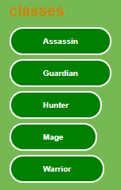
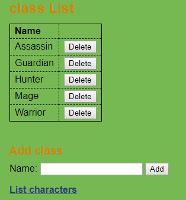
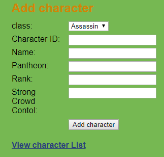
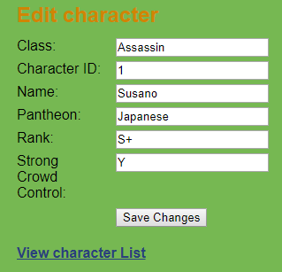
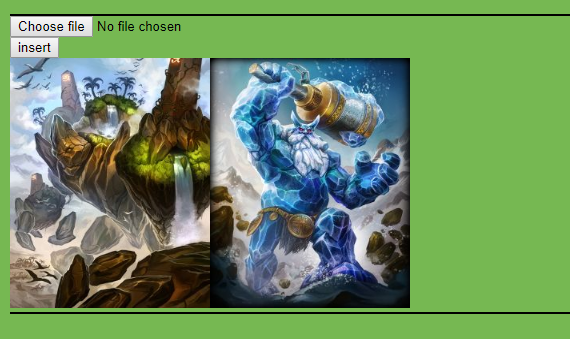

# mvc

Smite is a free-to-play, third-person multiplayer online battle arena (MOBA) video game developed and published by Hi-Rez Studios for Microsoft Windows, macOS, PlayStation 4, Nintendo Switch, and Xbox One.

In Smite, players control a god, goddess, or other mythological figure and take part in team based combat, using abilities and tactics against other player-controlled gods and non-player-controlled minions.

# Game Modes #

  - Conquest - 5v5
  - Arena - 5v5
  - Clash - 5v5
  - Assaualt -5v5
  - Siege - 4v4
  - Joust - 3v3
  
  # Pantheons # 
  
  - Arthurian
  - Chinese
  - Celtic
  - Egyptian
  - Greek
  - Hindu
  - Japanese
  - Mayan
  - Norse
  - Polynesian
  - Roman
  - Slavic
  - Voodoo
  
  # My System # 
  
  This system allows the user to look up characters and their details. The system will allow the user to filter
  characters by their class as shown below. To do this you can click on the different class buttons.
  This will change the characters that are displayed with the ones categorised by the class you clicked on:
  
  
  
  
  If these classes are not enough the can add as well as delete classes. This is done by clicking the delete button.
  To add new classes simply type the class name into the text box and then click the add button:
  
  
  
  
  The system also always the user to add new characters as the game is updated. Once you have typed in all the 
  characters details it will add it to the database and will be displayed under the class you categorised the 
  character as:
  
  
  
  
  If the user inputs details of a character incorrectly the system will also allow the user to edit the details. 
  Once you have changed the details click on the save changes button and the updated character will appear
  under the class you have categorised the character as:
  
  
  
  The users can also view what the characters look like in game as well as add images for any new characters.
  The user can click on choose file which will then prompt the user to input an image. Once the user has done that 
  you then click on insert and the image will appear along side the rest of the images:
  
  
 
## What do you need to use the system ##

   [MySQL][sqlLink]\
   [XAMPP][xamppLink]\
   [MyPHPAdmin][myphpadminLink]

[sqlLink]: https://www.mysql.com/
[xamppLink]: https://www.apachefriends.org/index.html
[myphpadminLink]: https://www.phpmyadmin.net/downloads/

# TO Do #

  - Incorporate the upload image currently in gallery into the add and edit character details pages so the images are uploaded
  there and they will appear beside the characters on the main page instead of on a separate gallery page
  - Add more css to make the website more presentable 
  - Add more features
